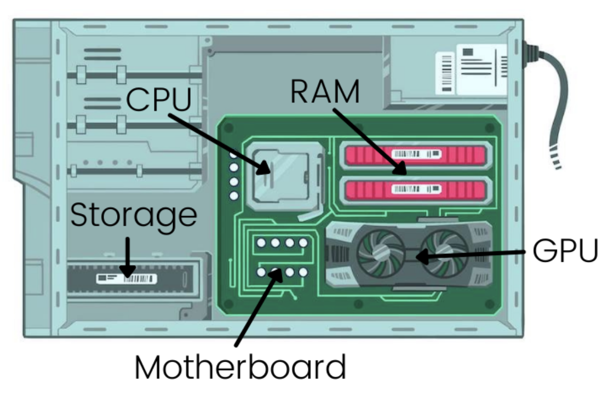
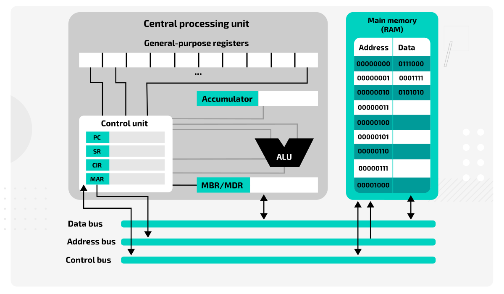

# Components

## 1.1 Relació dels programes amb els components del sistema informàtic

Els programes informàtics són conjunts d'instruccions que permeten realitzar diverses tasques sobre un sistema informàtic. Aquests programes interactuen amb diferents components del sistema perquè puguin ser executats correctament. 

### **Memòria (RAM)**

- La **memòria RAM (Random Access Memory)** és una part essencial del sistema informàtic. És un tipus de memòria volàtil que emmagatzema dades temporalment i s'utilitza per carregar les instruccions dels programes mentre s'executen.
- Els programes s’han de carregar a la RAM perquè la **CPU** pugui accedir ràpidament a les seves instruccions. La velocitat d’accés a la RAM és molt superior a la dels discos durs, fet que permet una execució eficient dels programes.
- Cada procés en execució té assignat un espai a la RAM on guarda les instruccions i les dades necessàries per funcionar. Quan aquest espai es queda curt, el sistema operatiu pot utilitzar la **memòria virtual**, emmagatzemant part d’aquesta informació al disc dur, però amb un rendiment significativament inferior.
  
**Exemple pràctic:**
- Quan obres un navegador web com **Google Chrome**, el sistema carrega el programa a la RAM, de manera que pugui respondre ràpidament a les teves accions, com obrir una nova pestanya o carregar una pàgina web. Si la memòria RAM disponible és insuficient, el sistema pot utilitzar el disc dur per gestionar les tasques, però això alentirà el rendiment.

### **Processador (CPU)**

- El **processador** (o **CPU**, Central Processing Unit) és el component principal del sistema que s'encarrega d'executar les instruccions dels programes. Cada instrucció que s'executa dins d'un programa és processada directament per la CPU.
- La CPU segueix un cicle bàsic d’operacions: **[Fetch-Decode-Execute](https://adacomputerscience.org/concepts/arch_fe_cycle?examBoard=ada&stage=all)**:

  - **Fetch (Obtenció):** Recull les instruccions del programa que es troben emmagatzemades a la RAM.
  - **Decode (Descodificació):** Interpreta aquestes instruccions per saber què ha de fer.
  - **Execute (Execució):** Realitza l’operació (com sumar números, moure dades de la memòria, o controlar un perifèric).
- La **velocitat del processador**, expressada en **gigahertzs (GHz)**, determina quantes operacions pot realitzar per segon. Una CPU més ràpida pot processar més instruccions i, per tant, fer que els programes s’executin més ràpidament.
- Els processadors moderns tenen diversos **nuclis** (cores), cosa que els permet executar múltiples operacions simultàniament (**multithreading**), millorant encara més el rendiment.

**Exemple pràctic:**
- En un programa que suma dos números, la CPU obtindrà les instruccions per sumar, identificarà les dades involucrades (els dos nombres) i executarà l'operació. Un processador amb diversos nuclis pot fer altres tasques simultàniament, com reproduir música mentre es realitza aquest càlcul.

### **Perifèrics**

- Els **perifèrics** són els dispositius d'entrada i sortida que permeten la interacció entre el sistema informàtic i l'usuari o altres sistemes. Aquests dispositius permeten capturar dades o presentar resultats d'un programa.
- **Perifèrics d'entrada:** Són dispositius que permeten introduir informació al sistema. Exemples: teclat, ratolí, micròfon, escàner.
- **Perifèrics de sortida:** Són dispositius que permeten visualitzar o emmagatzemar la informació processada pel sistema. Exemples: pantalla, impressora, altaveus.
- **Perifèrics d'emmagatzematge:** S'utilitzen per guardar dades de manera permanent o temporal. Exemples: discos durs, unitats SSD, memòries USB.
  
**Exemple pràctic:**

- Quan escrius un document a l'ordinador, el teclat (perifèric d'entrada) envia els caràcters al processador, que els processa i els mostra a la pantalla (perifèric de sortida). Si decideixes guardar el document, les dades es desaran en un disc dur o una unitat SSD (perifèrics d'emmagatzematge).

