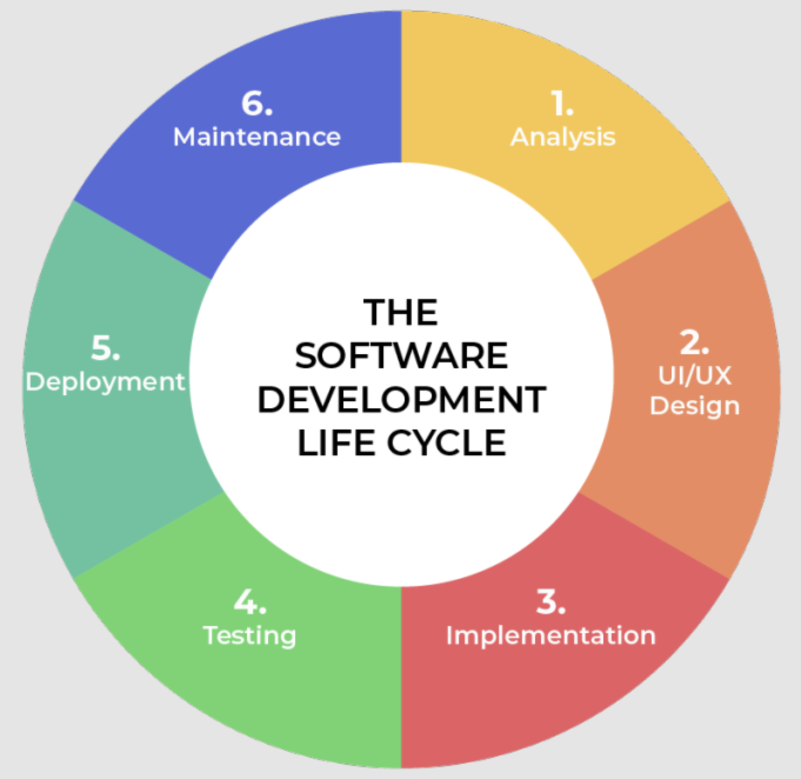

# Desenvolupament

## 1.2 Fases de desenvolupament d'una aplicació informàtica

El procés de desenvolupament de programes segueix un conjunt de fases, que asseguren que el producte final compleixi els requisits del client i funcioni correctament. Aquestes fases són iteratives en molts enfocaments moderns, especialment en metodologies àgils, on el producte es va refinant i millorant al llarg de diversos cicles.

### 1. **Anàlisi de requeriments**

L'**anàlisi de requeriments** és la primera fase del desenvolupament i una de les més crucials. Es tracta de definir amb claredat què ha de fer el sistema que es vol desenvolupar:

- **Objectius:** S'identifiquen els objectius generals que ha de complir el programari, tant des del punt de vista funcional com no funcional.
- **Funcionalitats:** Es recullen i descriuen les característiques que el sistema haurà de proporcionar. Això inclou tasques específiques que l'usuari podrà realitzar.
- **Limitacions:** Es defineixen els requisits tècnics, legals i de rendiment, així com qualsevol restricció que afecti el desenvolupament, com el temps, pressupost, o limitacions tecnològiques.

**Exemple pràctic:**
- Si es desenvolupa una aplicació de comerç electrònic, durant l'anàlisi de requeriments es defineix que l'usuari ha de poder crear un compte, cercar productes, afegir-los a la cistella i realitzar compres segures amb diversos mètodes de pagament.

### 2. **Disseny**

La fase de **disseny** implica la planificació detallada de com es construirà el sistema, a partir dels requeriments definits:

- **Disseny de l'arquitectura:** Es defineix l'estructura general del sistema. Això inclou com interactuaran els diferents components del sistema (back-end, front-end, bases de dades, etc.).
- **Disseny de les dades:** S'escull l'estructura de dades adequada (bases de dades relacionals o NoSQL, per exemple) i es defineixen els esquemes de les taules o documents.
- **Algorismes:** Es seleccionen els algorismes més eficients per resoldre les tasques que el sistema ha de realitzar, com ara cerques, ordenació, etc.
- **Disseny de la interfície d'usuari (UI):** Si s'aplica, es defineix com serà la interfície amb la qual interactuarà l'usuari, incloent-hi la disposició de botons, menús, formularis, etc.

**Exemple pràctic:**
- Per a una aplicació de comerç electrònic, durant el disseny es defineix l'arquitectura MVC (Model-Vista-Controlador), la base de dades MySQL per emmagatzemar informació sobre els usuaris, productes i comandes, i es crea un disseny atractiu per a la pàgina de compra.

### 3. **Desenvolupament o codificació**

La **codificació** és la fase en la qual es passa del disseny teòric a la implementació pràctica. Els desenvolupadors escriuen el codi font que materialitza les funcionalitats i els algorismes dissenyats prèviament:

- **Selecció del llenguatge de programació:** Es tria el llenguatge o llenguatges de programació adequats segons el projecte. Per exemple, **JavaScript** per al front-end, **Python** o **Java** per al back-end.
- **Escripció del codi:** Els programadors escriuen el codi per implementar cada funcionalitat, seguint les bones pràctiques de programació, com modularitat, reusabilitat i legibilitat.
- **Gestió del codi:** Durant aquesta fase, és fonamental utilitzar eines com **Git** per controlar les versions del codi i facilitar el treball col·laboratiu entre diversos desenvolupadors.

**Exemple pràctic:**
- Un equip de desenvolupadors implementa una API REST en **Node.js** per gestionar les operacions de productes, clients i comandes, mentre un altre equip crea la interfície d'usuari amb **React**.

### 4. **Proves (Testing)**

La fase de **proves** és crucial per assegurar que el programari compleixi els requeriments i funcioni sense errors:

- **Proves unitàries:** Es proven individualment les funcions o mòduls per garantir que cadascuna realitza la seva tasca correctament.
- **Proves d'integració:** Es verifica que els diferents components del sistema interactuen correctament entre si.
- **Proves d'acceptació:** Es comprova que el sistema compleix els requisits del client i que les funcionalitats funcionen segons s'esperava.
- **Proves de rendiment i seguretat:** Es mesura la velocitat, l'eficiència i la resistència del sistema a possibles atacs, assegurant que pot gestionar grans càrregues o situacions extremes.

**Exemple pràctic:**
- Un equip de QA realitza proves automàtiques en les APIs del sistema de comerç electrònic utilitzant **JUnit** i eines com **Postman** per assegurar que els endpoints compleixen les expectatives funcionals i de seguretat.

### 5. **Implementació**

La fase d'**implementació** és quan el programari es posa en producció, de manera que pugui ser utilitzat pels usuaris finals:

- **Desplegament:** S'instal·la el programari en l'entorn on serà utilitzat, que pot ser un servidor local, un servidor remot o el núvol.
- **Configuració:** Es realitzen ajustos específics per assegurar que el programari funciona correctament amb els sistemes existents.
- **Llançament:** Després de les proves finals, el sistema es llança per a l'ús dels usuaris finals. Aquesta fase pot incloure formació als usuaris i suport tècnic inicial.

**Exemple pràctic:**
- Es desplega l'aplicació de comerç electrònic en un servidor **AWS** utilitzant **Docker** per contenir les diferents parts del sistema, i es configura per a l'accés global a través d'Internet.

### 6. **Manteniment**

El **manteniment** és una fase contínua que comença després de la implementació del programari. Inclou:

- **Correcció d'errors:** A mesura que s'utilitza el sistema, poden sorgir errors o problemes no detectats durant les proves. Aquests s'han de corregir amb actualitzacions del programari.
- **Actualitzacions i millores:** Es poden afegir noves funcionalitats o millorar-ne d'existents en funció dels canvis en les necessitats dels usuaris o l'evolució tecnològica.
- **Suport tècnic:** Es proporciona suport als usuaris finals per resoldre dubtes o incidències tècniques.

**Exemple pràctic:**
- Després del llançament de l'aplicació de comerç electrònic, es detecten alguns errors en els mètodes de pagament en determinades regions. Els desenvolupadors els corregeixen i publiquen una actualització del sistema.

